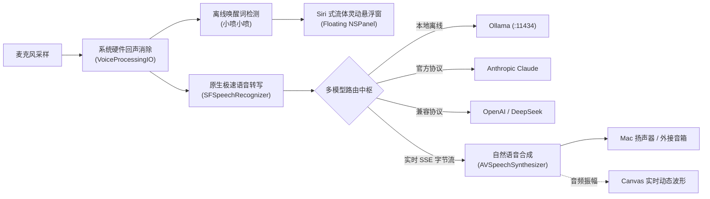

# 小喷 for Mac (XiaoPen for Mac)

> 🍎 **专为 Mac 打造的原生桌面 AI 智能音箱应用**。  
> 随时免提语音唤醒，接入本地 Ollama 或云端顶尖大模型（Claude 3.7 / OpenAI / DeepSeek），配备苹果硬件级声学回声消除与 Siri 式流体灵动悬浮窗。

[](https://www.apple.com/macos/)
[](https://swift.org)
[](LICENSE)

---

## 🌟 核心特色

1. **真·免提唤醒**：
   - 对着空气喊一声**“小喷小喷”**（或自定义唤醒词），即刻唤醒响应，无需点击或按键。
2. **硬件级声学回声消除 (AEC)**：
   - 深度集成 macOS `AVAudioEngine` 的 `VoiceProcessingIO` 语音处理单元，音箱自身播放音乐或回复时，不会误触发麦克风唤醒。
3. **多脑自由调度 (Multi-Brain Router)**：
   - **本地免费派**：直连本地 **Ollama**（一键运行 DeepSeek R1、Qwen 2.5、Llama 3 等），零网络依赖，数据绝对隐私。
   - **云端最强派**：直连 **Anthropic Claude 3.5 / 3.7 Sonnet** 官方接口，支持深度思考与流式吐字。
   - **高性价比派**：直连 **OpenAI 兼容接口**（DeepSeek 官方 API、SiliconFlow、Kimi、Moonshot、vLLM）。
4. **精美灵动呈现**：
   - 菜单栏无感常驻，唤醒时优雅浮现半透明磨砂毛玻璃发光球（Siri 灵感）与实时声波流，不抢占当前前台窗口焦点。
5. **苹果原生工艺**：
   - 100% 纯 Swift 6 + SwiftUI + CoreAudio 原生开发，内存占用仅约 30MB，CPU 待机开销低于 0.5%，绝非 Electron 网页套壳。

---

## 🏗️ 架构概览



---

## 🚀 快速开始

### 1. 编译与运行

本项目使用标准 **Swift Package Manager** 构建，支持命令行或 Xcode 打开：

#### 方式 A：命令行运行
```bash
# 编译并直接运行
swift run XiaoPen
```

#### 方式 B：使用 Xcode 打开
```bash
# 在 Xcode 中打开工程（双击 Package.swift 或执行以下命令）
xed .
```
在 Xcode 顶部选择目标 `My Mac`，点击 **Run (Cmd + R)** 即可。

---

### 2. 快捷键与使用

* **免提唤醒**：麦克风保持监听，直接说话**“小喷小喷”**即可唤醒。
* **手动唤醒对讲**：`Command + Shift + K`
* **偏好设置**：`Command + ,`
* **退出应用**：`Command + Q`

---

## ⚙️ 模型配置指南

在顶部菜单栏点击小喷图标，选择 **偏好设置...**：

### 1. 本地 Ollama
* 确保本机已启动 Ollama（`ollama serve`）；
* Base URL 填写 `http://127.0.0.1:11434`；
* 模型名称填写已拉取的模型（例如 `qwen2.5:latest` 或 `deepseek-r1:8b`）；
* 点击“测试模型连通性”，显示绿色通过后即可断网离线对话！

### 2. Anthropic (Claude)
* 选择“Anthropic (Claude)”；
* 填入您的 `Claude API Key`（密钥会自动存入 macOS 底层安全 Keychain 金库，绝不明文落盘）；
* 模型默认使用 `claude-3-5-sonnet-latest`。

### 3. OpenAI 兼容接口
* 选择“OpenAI 兼容接口”；
* 适配 DeepSeek、SiliconFlow 等国内服务商：
  - Base URL：`https://api.deepseek.com`
  - Model：`deepseek-chat` 或 `deepseek-reasoner`
  - API Key：填入对应的 Key。

---

## 📄 开源许可证

本项目采用 [MIT License](LICENSE) 开源许可。
