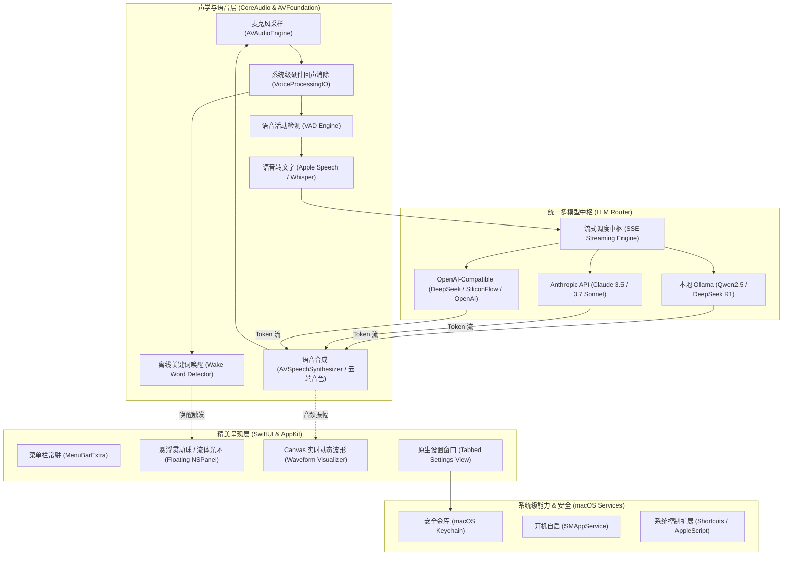

# XiaoPen for Mac（小喷 Mac）项目规划书

> **产品定位**：将常驻 Mac mini / MacBook 一键打造为精美、低占用、支持随时免提语音唤醒与全模型接入（本地 Ollama / Anthropic Claude / OpenAI 兼容）的次时代家庭 AI 智能音箱原生 macOS 应用。

---

## 一、产品愿景与核心痛点

### 1. 核心痛点
* **传统智能音箱太封闭**：小爱同学、HomePod 等音箱“大脑”迟钝，无法接入 DeepSeek、Claude、GPT-4o 或本地私有模型，提示词与人设无法自定义。
* **现有 Mac AI 软件是“键盘生产力工具”**：市面上的 MacGPT、BoltAI、Raycast AI 都是靠按快捷键唤出、敲键盘打字，缺乏作为“家庭实体音箱”的随时免提语音体验。
* **开源极客脚本体验粗糙**：GitHub 上的语音脚本多为命令行或简陋 Python 脚本，缺乏专业声学回声消除（放音乐时误唤醒）和苹果原生精美交互。

### 2. 产品愿景
开发一款**100% 苹果原生、工艺精湛、开机自启、零配置门槛**的 macOS 智能音箱应用。
- 对着空气喊一声**“小喷小喷”**即可唤醒；
- 屏幕浮现类似 **Siri / 灵动岛风格的流体发光球与实时声波**；
- 背后可自由调遣**本地 Ollama（断网免费且隐私）**或**云端顶尖大模型（Claude 3.7 / DeepSeek / OpenAI）**；
- 具备硬件级**回声消除（AEC）**，播放声音或放音乐时不会自己吵醒自己。

---

## 二、系统架构设计

---

## 三、关键技术选型（Apple Native 原生栈）

| 模块 | 推荐技术 | 选型考量与优势 |
| :--- | :--- | :--- |
| **开发语言** | **Swift 6** | 启用严格并发模型（Actor-based Strict Concurrency），零数据竞争，极致性能与安全。 |
| **界面框架** | **SwiftUI + AppKit** | 结合 `@Observable` 宏、`NSVisualEffectView` 磨砂毛玻璃材质、`Canvas` 高帧率粒子声波绘制。 |
| **唤醒与窗口** | **无边框浮动 `NSPanel`** | `.nonactivatingPanel` 级别，唤醒时出现但不抢占用户当前前台软件的键盘焦点。 |
| **声学引擎** | **`AVAudioEngine` + `VoiceProcessingIO`** | 启用 macOS 专属语音处理单元，天然具备**声学回声消除（AEC）**、自动增益（AGC）与降噪。 |
| **语音转文字 (ASR)** | **Apple `SFSpeechRecognizer` / Local Whisper** | 原生 ASR 零延迟、不耗网络、完全免费；可无缝切到本地 Whisper。 |
| **语音合成 (TTS)** | **`AVSpeechSynthesizer` / 云端 TTS** | 原生高质量神经网络音色（如婷婷 Tingting、美佳），支持流式句段打断。 |
| **模型流式通信** | **`URLSession` AsyncStream** | 原生处理 Server-Sent Events (SSE) 流式传输，打字机式首字延迟低至 300ms。 |
| **安全存储** | **macOS Keychain Services** | API Key 存入系统底层加密密钥串，拒绝明文落地。 |

---

## 四、功能模块规划

### 1. 灵动桌面态（Ambient Display）
- **待命状态**：菜单栏呈现微光粒子图标，整机内存占用仅 30-50MB，CPU 接近 0%。
- **唤醒状态**：
  - 屏幕右上角或桌面优雅浮现半透明发光光晕（支持可拖拽锚定位置）；
  - 发光球体随说话音量发生拟物呼吸形变（类似 Siri / 灵动岛）；
  - 伴随清脆原生的确认音。
- **对话状态**：实时打字机浮现模型回答，说完后根据配置保持 3-5 秒后柔和淡出隐藏。

### 2. 多脑切换（Multi-Brain Engine）
- **Ollama 本地大脑**：
  - 自动探测 `http://127.0.0.1:11434`；
  - 自动列出本地已下载的全部模型供下拉选择；
  - 完全脱网断网可用。
- **Anthropic 官方协议大脑**：
  - 原生支持 Claude 3.5/3.7 系列；
  - 支持 System Prompt、角色人格配置；
  - 支持启用“深度思考（Extended Thinking）”。
- **OpenAI 兼容大脑**：
  - 支持自定义 Base URL（适配 DeepSeek、SiliconFlow、月之暗面、自建 vLLM 等）；
  - 可配置 Temperature、Max Tokens 等高级参数。

### 3. 声学控制与外设适配
- 完美解决 Mac mini 无内置麦克风特性：
  - 自动列出当前系统中所有连接的音频输入设备（USB 会议麦、USB 摄像头麦、蓝牙耳机、外接声卡）；
  - 支持热插拔监听与默认设备自动跟随。

---

## 五、开发里程碑（Milestones）

* **Milestone 1：项目骨架与原生构建环境（Day 1）**
  - [x] 初始化 Swift 6 原生 Package 与工程配置
  - [x] 创建 GitHub 独立仓库并建立主干保护
  - [x] 搭建基础状态机模型（`AppState`、`Observation`）
* **Milestone 2：声学管道与音频采集原型（Day 2）**
  - [ ] 封装 `AudioEngineManager`，开启 `VoiceProcessingIO` 回声消除
  - [ ] 实现麦克风实时音量振幅计算，驱动声波动画
  - [ ] 集成 Apple 原生 `SFSpeechRecognizer` 与 `AVSpeechSynthesizer`
* **Milestone 3：多模型流式路由器与安全金库（Day 3）**
  - [ ] 实现 Ollama、Anthropic、OpenAI 统一的流式调用协议
  - [ ] 集成 macOS Keychain 保存敏感 Key
  - [ ] 完善 Prompt 设定与打字机响应流
* **Milestone 4：精美 UI 动效与交互打磨（Day 4）**
  - [ ] 实现无抢焦发光悬浮窗（Floating HUD Panel）
  - [ ] 研发 Canvas 流体发光球与声波渲染组件
  - [ ] 原生设置偏好面板（Settings Window）
* **Milestone 5：常驻唤醒与开机自启打磨（Day 5）**
  - [ ] 离线免提唤醒词优化
  - [ ] 系统级开机自启与全局快捷键双模唤醒
  - [ ] 打包为独立 `.dmg` / `.app`
